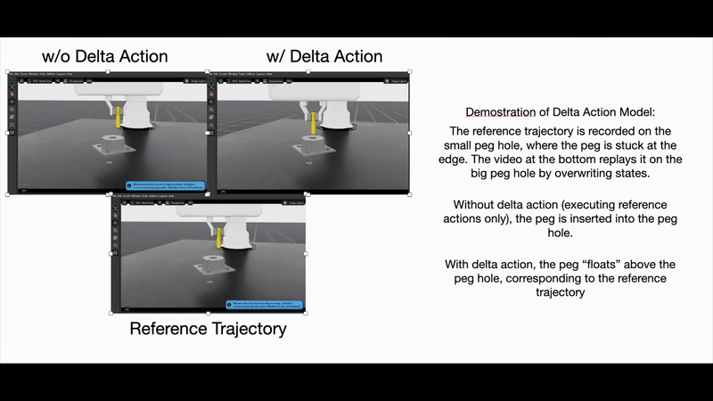

# Delta Action Model for Contact-Rich Tasks

Learning a delta action model that makes up for dynamic difference between sim and real for contact-rich tasks.

## Table of Contents
- [Installation](#installation)
- [Quick Start](#quick-start)
- [Demo](#demo)
- [Project Structure](#project-structure)
- [Troubleshooting](#troubleshooting)
- [Citation](#citation)

## Installation

This is specific to IsaacSim 5.0.0 with IsaacLab 2.3.0 because this uses specific package versions. Other versions are not tested.  

The installation process largely follows [the official guide](https://isaac-sim.github.io/IsaacLab/main/source/setup/installation/binaries_installation.html), but with minor modifications to maximize the potential with uv. 

### 1. Install Isaac Sim

Follow the guide to everything before the `Installing Isaac Lab` section. 

### 2. Install IsaacLab

Use the IsaacLab with modified environment in this repo and create the Isaac Sim Symbolic Link. 

### 3. Setting up a Python Environment 

The remainder of this guide assumes that your IsaacLab will be under the root of your project folder like
```bash
-- Delta-Action-Model-for-Contact-Rich-Tasks
 |  -- main.py
 |  -- IsaacLab
 |  -- configs/
 |  -- scripts/
```

**NOTE** The way IsaacLab's official way of installing with uv is suboptimal:  
1. Does not take advantage of uv's ultra-fast dependency parsing.
2. Does not use uv's strict version locking and guarantee system. 

which are the two major selling points of `uv` in the first place. Essentially, all it uses uv for is creating a venv, and rolls back to pip for everything else.  

Therefore, we modify the env creation and package installation process in Step 4. 

### 4. Installation

First, install the system dependencies: 
```bash
# these dependencies are needed by robomimic which is not available on Windows
sudo apt install cmake build-essential

# additional dependencies for pygame (required by rl-games)
sudo apt-get install -y libsdl2-dev libsdl2-image-dev libsdl2-mixer-dev libsdl2-ttf-dev libfreetype6-dev libjpeg-dev libpng-dev libportmidi-dev
```

Then, replacing the official guide to run `isaaclab.sh --uv my_env`, actually run:
```bash
uv init
uv sync     # to create the .venv
```
in your project root, so you have control of your environment in your project, not within the path of IsaacLab. 

To add environment variables, the official script injects commands into `.venv/bin/activate` (or the conda equivalent), but this is not very convenient, since `uv run` and VSCode debugger bypass that.  

The alternative recommendation is to use `direnv` as a shell extension, which auto-loads and unloads env variables as you enter and exit directories. Create a `.envrc` file and register some environment variables required by IsaacLab/IsaacSim: 

```bash
# Isaac Lab setup
export ISAACLAB_PATH="${PWD}/IsaacLab"
alias isaaclab="${PWD}/IsaacLab/isaaclab.sh"
export RESOURCE_NAME="IsaacSim"

# Source Isaac Sim environment if available (binary install)
if [ -f "${ISAACLAB_PATH}/_isaac_sim/setup_conda_env.sh" ]; then
    . "${ISAACLAB_PATH}/_isaac_sim/setup_conda_env.sh"
fi

# Add project root to PYTHONPATH for local imports
export PYTHONPATH="${PWD}:${PYTHONPATH}"
```

Then, replacing the official guide to run `isaaclab.sh --install`, modify your `pyproject.toml` so that ALL required packages (RL, testing, dev tools) are in the main dependency list (no extras needed).

Then, run `uv sync` to install all required dependencies.

### 5. Verifying the Installation

Since we are using the python from the uv venv, we can test the IsaacLab installation with:
```bash
source .venv/bin/activate

# Empty example
python3 IsaacLab/scripts/tutorials/00_sim/create_empty.py

# Train a robot example
python3 IsaacLab/scripts/reinforcement_learning/rsl_rl/train.py --task=Isaac-Ant-v0 --headless
```

**Note:** We are not using `uv run` because this command bypasses the `activate` command which sets some aliases and env variables that are required for IsaacSim to be detected. 

---

## Quick Start

### Train a base policy in simulation
First, in factory_env_cfg.py, set scale_fixed_asset: tuple = (2.0,2.0,1.0). This corresponds to the big peg hole in simulation.
You may use default IsaacLab command to train a base policy in simulation.
```bash
./isaaclab.sh -p scripts/reinforcement_learning/rl_games/train.py \
  --task Isaac-Factory-PegInsert-Direct-v0 --num_envs 64 
```

### Collect reference trajectories
We can then use this policy to collect 50 trajectories on the small peg hole. 
Before collecting reference trajectories, set scale_fixed_asset: tuple = (1.0,1.0,1.0). This corresponds to the small peg hole in "reality".
```bash
uv run script_peg_insert/record_ref.py --task Isaac-Factory-PegInsert-Direct-v0 --agent rl_games_cfg_entry_point --checkpoint [your checkpoint path] --num_episodes 50 
```

### Train the delta action model
In script_peg_insert/train.py, replace the reference trajectory path with your own path and customize training episodes, then: 
```bash
uv run  script_peg_insert/train.py --task Isaac-Factory-PegInsert-Delta-Direct-v0 --num_envs 64 
```
### Fine-tune the policy in simulation
We can then augment the environment with the delta actio model and fine-tune the policy. Before training, replace the path for delta action model with your own.
```bash
run  script_peg_insert/train_closeloop.py --task Isaac-Factory-PegInsert-Delta-CloseLoop-v0 --num_envs 64
```

### Evaluate the original or fine-tuned policy
In test_success.py, replace the model path with your own and test its success rate.
```bash
uv run script_peg_insert/test_success.py 
```

## Demo




## Project Structure

```
Delta-Action-Model-for-Contact-Rich-Tasks/
├── IsaacLab/                           # Modified Isaac Lab with factory tasks
│   └── source/isaaclab_tasks/
│       └── direct/factory/             # Contains modified peg insertion envs for delta action model training and policy fine-tuning
├── script_peg_insert/                  # Main scripts
│   ├── train.py                        # Train base open-loop policy
│   ├── train_closeloop.py              # Train delta model (closed-loop)
│   ├── record_ref.py                   # Record reference trajectories
│   ├── inspect_rec.py                  # Inspect recorded data
│   ├── test_success.py                 # Evaluate success rate
│   ├── ...                             # Other useful scripts
├── main.py                             # Entry point (if needed)
├── pyproject.toml                      # Python dependencies
├── . envrc                              # Environment variables
├── . gitignore                          # Git ignore rules
├── final_report.pdf                    # Project report
├── demo video.mp4                      # Demo video
└── README.md     
```

---

## Adding Packages to Your Project

Just follow the standard `uv` practice and add packages and package index to `pyproject.toml`, then run `uv sync` to realize changes.  No extras flag is needed since everything is in the base dependency list.

---

## Troubleshooting


---

## Citation


---

## License


## Contact

For questions or issues, please open an issue on GitHub or contact iamdonkh@umich.edu


